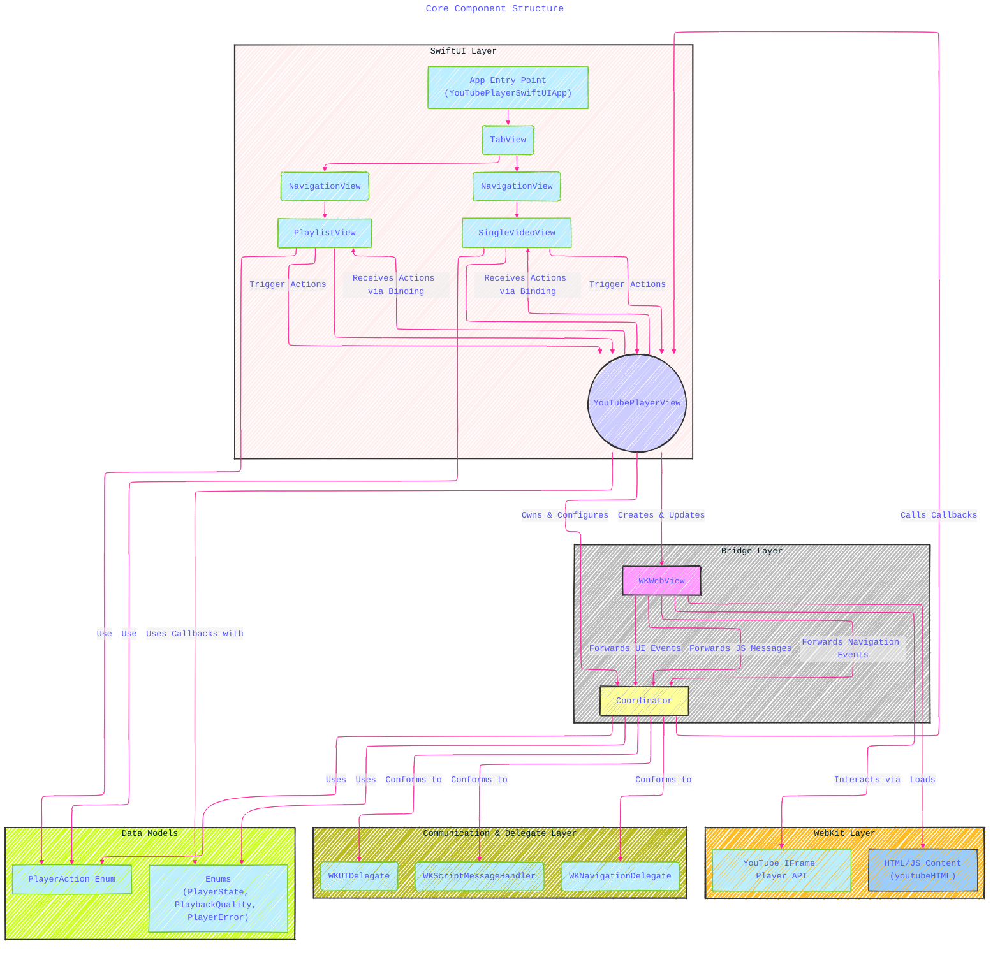
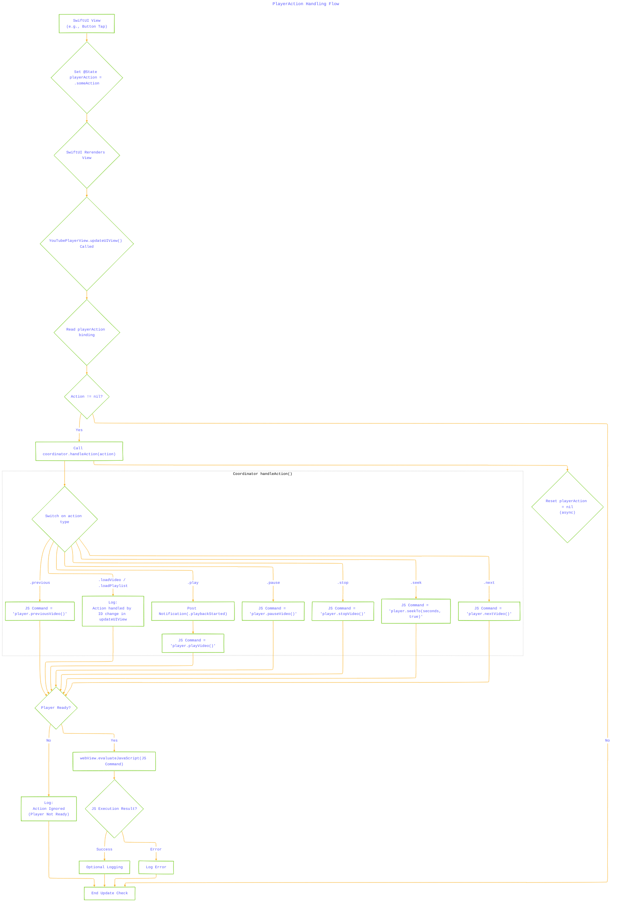
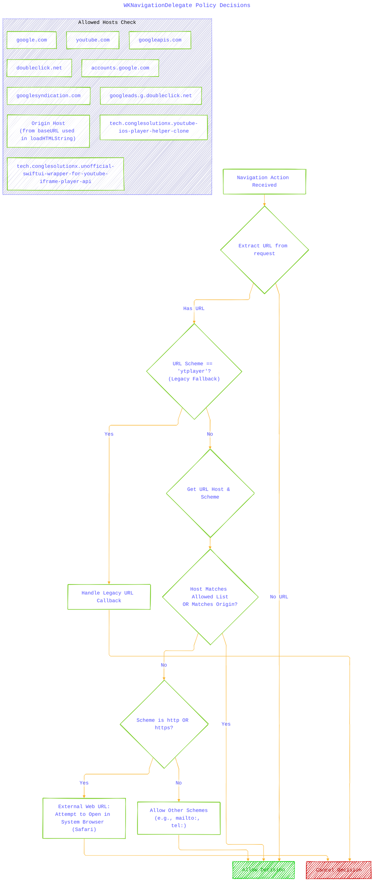

# Documentation: Unofficial SwiftUI Wrapper for YouTube IFrame Player API
> **Important Disclaimer & Notice:**
>
> This document and the accompanying code represent **personal notes and an unofficial implementation** created for educational purposes, study, and reference, based on the publicly available **YouTube IFrame Player API** and inspired by the official `youtube-ios-player-helper` project (available at [https://github.com/youtube/youtube-ios-player-helper](https://github.com/youtube/youtube-ios-player-helper)).
>
> **This project is NOT an official YouTube or Google product.** It is not affiliated with, endorsed by, or sponsored by Google LLC or YouTube. All trademarks, logos, and brand names associated with YouTube and Google are the property of their respective owners. Use of the YouTube IFrame Player API is subject to the [YouTube API Services Terms of Service](https://developers.google.com/youtube/terms/api-services-terms-of-service).
>
> The materials herein are provided "as is" without warranty of any kind. The author assumes no responsibility or liability for any errors or omissions in the content or for any actions taken based on the information provided.
>
> **Licensing:**
> The content is dual-licensed:
> 1.  **Apache License 2.0:** Applies to all **code implementations** (Swift, JavaScript snippets within the HTML, etc.). See the [LICENSE](LICENSE) file.
> 2.  **Creative Commons Attribution 4.0 International License (CC BY 4.0):** Applies to all **non-code content**, including explanatory text, diagrams (as visual representations), and illustrations. See the [LICENSE-CC-BY](LICENSE-CC-BY) file.
> ---

## Overall Purpose - A Diagrammatic Guide

This code implements a reusable SwiftUI view (`YouTubePlayerView`) that embeds a YouTube player using a `WKWebView`. It acts as a bridge between the JavaScript-based **YouTube IFrame Player API** and the native Swift/SwiftUI environment. This allows developers to control the player (play, pause, seek, etc.) from Swift and receive player events (state changes, errors, playback time) back into their SwiftUI application. The implementation handles both single video and playlist playback and includes mechanisms for coordinating multiple player instances within an app.

**Key Concepts Illustrated:**

1.  **Core Components and Structure**
2.  **SwiftUI <-> WKWebView Bridge (`UIViewRepresentable`)**
3.  **JavaScript <-> Swift Communication**
4.  **State Management (Player & View)**
5.  **Action Handling Flow**
6.  **Navigation and Security (`WKNavigationDelegate`)**
7.  **Multi-Player Interaction (`NotificationCenter`)**
8.  **Initialization and Parameter Injection**

---

### 1. Core Components and Structure

This diagram shows the main building blocks of the player implementation and their high-level relationships.

**Explanation:**

*   The SwiftUI layer contains the main App structure and the specific views (`SingleVideoView`, `PlaylistView`) that *use* the `YouTubePlayerView`.
*   `YouTubePlayerView` acts as the `UIViewRepresentable` bridge, creating and managing the `WKWebView` and its `Coordinator`.
*   The `WKWebView` loads the bundled `youtubeHTML` which contains the JavaScript code to interact with the **YouTube IFrame Player API**.
*   The `Coordinator` is the central hub, handling delegate methods from `WKWebView` (navigation, UI, JS messages) and translating communication between the web content and the SwiftUI view.
*   Data models (Enums) define the states, qualities, errors, and actions used throughout the system.

---

### 2. SwiftUI <-> WKWebView Bridge (`UIViewRepresentable` Lifecycle)

This diagram illustrates the lifecycle and data flow managed by the `YouTubePlayerView` struct conforming to `UIViewRepresentable`.

**Explanation:**

*   SwiftUI provides initial data (`videoId`, callbacks, etc.) to `YouTubePlayerView`.
*   `makeCoordinator` creates the `Coordinator` instance.
*   `makeUIView` creates and configures the `WKWebView`, setting the `Coordinator` as its delegate and script message handler. It also triggers the initial HTML load via the `Coordinator`.
*   `updateUIView` is called when SwiftUI detects changes. It reads the latest state properties, checks for actions triggered via the `@Binding`, handles potential reloads if IDs change, and informs the JS player about size changes.
*   The `Coordinator` handles calls from `makeUIView`/`updateUIView` and translates them into actions on the `WKWebView` (loading HTML, evaluating JavaScript). It also receives events from JS and invokes the callback closures provided by the SwiftUI view.

---

### 3. JavaScript <-> Swift Communication Flow

This sequence diagram details how messages are passed between the JavaScript environment within the `WKWebView` and the native Swift `Coordinator`.

**Explanation:**

*   **Initial Load:** Shows the sequence from SwiftUI initialization through HTML loading, JS execution, API readiness checks, and the final `onReady` signal back to Swift. It includes the API error handling path.
*   **Swift Action:** Demonstrates how a SwiftUI action (like setting `playerAction = .play`) flows through the `UIViewRepresentable` to the `Coordinator`, which evaluates the corresponding JavaScript command.
*   **JS Event:** Illustrates how an event triggered within the JS player (like a state change) is sent back via `postMessageToNative`, received by the `Coordinator`'s `userContentController` method, parsed, and finally triggers the appropriate Swift callback.
*   **Play Time:** Shows the periodic nature of the `onPlayTime` update using `setInterval` in JS.

---

### 4. Player State Management (`PlayerState` Enum & Transitions)

This state diagram visualizes the possible states of the YouTube player as defined by the `PlayerState` enum and typical transitions initiated by user actions or player events, reflecting the YouTube IFrame Player API states.

**Explanation:**

*   Shows the lifecycle of the player's state based on the `PlayerState` enum values (which directly map to the YouTube API states).
*   Arrows indicate common transitions triggered by specific API calls (like `playVideo()`, `pauseVideo()`) or internal player events (buffering, video end, errors).
*   An `Error` state can theoretically be entered from any other state upon receiving an error event from the JS API.
*   The `Unstarted` state often serves as a reset point when stopping or loading new content.

---

### 5. Action Handling Flow (`PlayerAction` Enum)

This flowchart details how a `PlayerAction` initiated from SwiftUI is processed and translated into JavaScript API calls.

**Explanation:**

*   Starts with a user interaction in SwiftUI setting the `playerAction` state variable.
*   This triggers `updateUIView` in the `YouTubePlayerView`.
*   The `Coordinator`'s `handleAction` method is invoked if an action exists.
*   The action binding is reset asynchronously.
*   **Crucially**, it first checks if the player `isPlayerReady` *before* attempting to execute commands.
*   A switch statement determines the appropriate JavaScript API call string based on the action type.
*   Load actions (`loadVideo`, `loadPlaylist`) primarily rely on the ID change detection logic in `updateUIView`, not direct JS evaluation here.
*   Playback/control actions result in `evaluateJavaScript` being called.
*   Results or errors from JavaScript execution are optionally logged.

---

### 6. Navigation and Security (`WKNavigationDelegate` Logic)

This flowchart outlines the decision process within the `webView(_:decidePolicyFor:)` delegate method to control navigation attempts within the `WKWebView`, prioritizing security and expected behavior.

**Explanation:**

*   Starts when the `WKWebView` attempts to navigate.
*   It first checks for the custom `ytplayer://` scheme (legacy fallback). If matched, the URL is handled, and navigation is **cancelled**.
*   Otherwise, it checks if the URL's host is within the `Allowed Hosts Check` list (YouTube domains, necessary Google services, the origin specified during loading). If allowed, navigation proceeds **within** the WebView (`Allow Decision`).
*   If the host isn't allowed but the scheme is HTTP/HTTPS, it's an external link. The system attempts to open it in the default browser (Safari), and navigation is **cancelled** within the WebView.
*   Other URL schemes (like `mailto:`, `tel:`) are generally **allowed**, letting the operating system handle them appropriately.

---

### 7. Multi-Player Interaction (`NotificationCenter`)

This sequence diagram shows how two instances of the player coordinate using `NotificationCenter` to pause one player when another starts playing.

**Explanation:**

*   Both player instances register with `NotificationCenter` to observe the `.playbackStarted` notification.
*   When Player 1 starts playing, its `Coordinator` posts the notification, including `self` as the `object`.
*   Player 1 receives the notification but ignores it because the sending `object` is itself.
*   Player 2 receives the notification, sees the `object` is different (it's Player 1's Coordinator), and executes the JavaScript to pause its own video.
*   The process reverses if Player 2 starts playing.
*   Observers are removed during deinitialization (`deinit`) to prevent issues.

---

### 8. Initialization and Parameter Injection

This diagram details the process of constructing the parameters dictionary and injecting it into the HTML template before loading the `WKWebView`.

**Explanation:**

*   The process starts with `performInitialLoad`.
*   `createPlayerParameters` builds the dictionary needed for the `YT.Player` constructor in JavaScript.
*   **Key Steps:**
    *   Sets essential `playerVars`: `origin` (for security) and `playsinline` (for behavior).
    *   Maps Swift event names to JS function names (e.g., `onReady` -> `"onReady"`).
    *   Adds either `videoId` or playlist-specific variables (`listType`, `list`) based on input.
    *   Includes placeholder dimensions (native code resizes later).
*   The dictionary is converted to JSON.
*   The JSON replaces the `"%@"` placeholder in the `youtubeHTML` string.
*   `loadHTMLString` is called with the finalized HTML and a `baseURL`, setting the web content's origin. Failures in JSON serialization trigger an error.

---

**Licenses:**

*   **Code:** The Swift and JavaScript code components of this project are licensed under the **Apache License 2.0**. The full license text should be included in a `LICENSE` file. 
*   **Documentation & Visuals:** The explanatory text, diagrams, and other non-code content in this document are licensed under the **Creative Commons Attribution 4.0 International License (CC BY 4.0)**. The full license text should be included in a `LICENSE-CC-BY` file and can be found at the [Creative Commons website](http://creativecommons.org/licenses/by/4.0/). 

---
